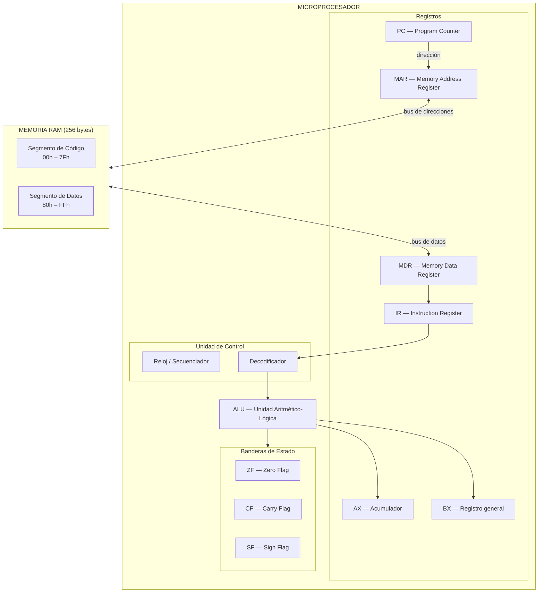

# Simulador de CPU — Arquitectura Von Neumann de 8 bits

**Materia:** Arquitectura de Computadoras (SIS131)
**Carrera:** Ingeniería de Software — UCB "San Pablo", Santa Cruz
**Plataforma:** Google Sheets + Google Apps Script (JavaScript)
**Repositorio:** [Gunter310/simulador_cpu](https://github.com/Gunter310/simulador_cpu)

Simulador interactivo del ciclo de instrucción completo (**Fetch → Decode → Execute → Store**) de un procesador de 8 bits, con memoria principal de 256 bytes, ALU con banderas de estado, y una interfaz visual con resaltado en tiempo real y log de micro-operaciones.

---

## 1. Arquitectura del sistema

El diseño sigue la arquitectura **Von Neumann**: el programa (instrucciones) y los datos conviven en la misma memoria de 256 bytes, y el procesador los recorre a través de un ciclo de reloj de 4 fases.



### Módulos del código (arquitectura modular)

| Archivo | Responsabilidad |
|---|---|
| `memory.gs` | Almacenamiento de los 256 bytes de RAM. Subrutinas `read(address)` y `write(address, value)`. |
| `alu.gs` | Operaciones aritméticas y lógicas. Calcula ZF, CF y SF tras cada cálculo. |
| `isa.gs` | Tabla de opcodes (diccionario número → instrucción). |
| `cpu.gs` | Máquina de estados del ciclo Fetch-Decode-Execute-Store. Persiste su estado en `PropertiesService` entre ejecuciones. |
| `control.gs` | Modo continuo (RUN) y PAUSE, con delay ajustable. |
| `matrix.gs` | Renderizado de la matriz de memoria 16×16 y panel de inspección de celdas. |
| `log.gs` | Log cronológico de micro-operaciones. |
| `ui.gs` | Actualización del panel de registros y resaltado visual por fase. |
| `formato.gs` | Formato visual de la hoja (títulos, bordes, colores). |
| `main.gs` | Carga de los programas demostrativos en memoria. |

Esta separación permite que, para el Segundo Parcial (Bus del Sistema, I/O, interrupciones), cada módulo pueda extenderse sin modificar los demás.

---

## 2. Mapa de memoria y registros

- **Direccionamiento:** 256 posiciones (`00h`–`FFh`), 1 byte por celda.
- **Segmento de Código:** `00h`–`7Fh` (donde se cargan las instrucciones).
- **Segmento de Datos:** `80h`–`FFh` (variables y resultados).
- **Persistencia:** tanto la memoria como el estado del CPU se guardan en `PropertiesService`, ya que cada clic en Google Sheets ejecuta el script de forma independiente y las variables normales no sobrevivirían entre clics.

| Registro | Tamaño | Función |
|---|---|---|
| PC | 8 bits | Dirección de la próxima instrucción |
| IR | 8 bits | Opcode de la instrucción en curso |
| MAR | 8 bits | Dirección de memoria que se está leyendo/escribiendo |
| MDR | 8 bits | Dato que viaja desde/hacia la RAM |
| AX | 8 bits | Acumulador de propósito general |
| BX | 8 bits | Registro general (usado como contador en los programas de prueba) |
| ZF | 1 bit | Se activa si el resultado de la ALU fue 0 |
| CF | 1 bit | Se activa si hubo desbordamiento (suma) o préstamo (resta) |
| SF | 1 bit | Copia el bit más significativo del resultado |

---

## 3. Conjunto de instrucciones (ISA)

Cada instrucción ocupa **2 bytes**: `[opcode][operando]`.

| Opcode (hex) | Opcode (dec) | Mnemónico | Bytes | Descripción |
|---|---|---|---|---|
| 0x01 | 1 | `MOV AX, imm` | 2 | AX ← valor inmediato |
| 0x02 | 2 | `MOV BX, imm` | 2 | BX ← valor inmediato |
| 0x03 | 3 | `MOV AX, BX` | 2 | AX ← BX |
| 0x04 | 4 | `MOV BX, AX` | 2 | BX ← AX |
| 0x05 | 5 | `LOAD AX, [dir]` | 2 | AX ← RAM[dir] |
| 0x06 | 6 | `LOAD BX, [dir]` | 2 | BX ← RAM[dir] |
| 0x07 | 7 | `STORE [dir], AX` | 2 | RAM[dir] ← AX |
| 0x08 | 8 | `STORE [dir], BX` | 2 | RAM[dir] ← BX |
| 0x10 | 16 | `ADD AX, imm` | 2 | AX ← AX + valor inmediato |
| 0x11 | 17 | `ADD AX, BX` | 2 | AX ← AX + BX |
| 0x12 | 18 | `SUB AX, imm` | 2 | AX ← AX − valor inmediato |
| 0x13 | 19 | `SUB AX, BX` | 2 | AX ← AX − BX |
| 0x14 | 20 | `INC AX` | 2 | AX ← AX + 1 |
| 0x15 | 21 | `INC BX` | 2 | BX ← BX + 1 |
| 0x16 | 22 | `DEC AX` | 2 | AX ← AX − 1 |
| 0x17 | 23 | `DEC BX` | 2 | BX ← BX − 1 |
| 0x18 | 24 | `CMP AX, imm` | 2 | Flags ← AX − valor inmediato (sin guardar resultado) |
| 0x19 | 25 | `CMP AX, BX` | 2 | Flags ← AX − BX (sin guardar resultado) |
| 0x20 | 32 | `JMP dir` | 2 | PC ← dir (incondicional) |
| 0x21 | 33 | `JZ dir` | 2 | Si ZF=1, PC ← dir |
| 0x22 | 34 | `JNZ dir` | 2 | Si ZF=0, PC ← dir |
| 0xFF | 255 | `HLT` | 2 | Detiene el reloj |

Un opcode no reconocido se interpreta como `NOP` (no hace nada), evitando que el simulador se detenga por error.

---

## 4. Ciclo de instrucción

Cada clic en **STEP** (o cada vuelta del bucle en **RUN**) avanza **una sola fase**, no una instrucción completa:

1. **FETCH** — `MAR ← PC`; `MDR ← RAM[MAR]`; `IR ← MDR`; `PC ← PC + 1`.
2. **DECODE** — `MAR ← PC`; `MDR ← RAM[MAR]` (el operando); `PC ← PC + 1`; se identifica la instrucción mediante la tabla ISA.
3. **EXECUTE** — La ALU calcula el resultado (o se evalúa un salto) y se actualizan ZF, CF, SF. El resultado se guarda temporalmente, **sin escribirse aún**.
4. **STORE** — El resultado se escribe en el registro destino (AX/BX) o en memoria (`RAM[MAR] ← MDR`).

> **Nota de lectura:** la etiqueta "Fase" que se muestra en pantalla siempre indica la fase que se ejecutará en el **próximo** clic, no la que se acaba de completar — es el mismo principio de un cartel de "próxima parada".

Las instrucciones de salto (`JMP`, `JZ`, `JNZ`) modifican `PC` directamente durante la fase **EXECUTE**, como única excepción a la regla de "todo se escribe en STORE".

---

## 5. Interfaz y modos de ejecución

| Control | Función |
|---|---|
| **STEP** (Ejecutar Paso) | Avanza una sola fase del ciclo |
| **RUN** | Ejecución automática continua, con velocidad ajustable en la celda "Delay (ms)" |
| **PAUSE** | Detiene el modo RUN en la iteración en curso |
| **RESET** (Reiniciar) | Restaura registros y PC a cero (no borra la memoria) |
| **LOAD PROGRAM** (Cargar Programa / Cargar Programa 2) | Carga un programa demostrativo en la RAM |

**Resaltado visual por fase** (colores en el panel de registros y en la matriz de memoria):
- 🟡 Amarillo: registros/celda en **lectura** (FETCH/DECODE)
- 🔵 Celeste: registros en **cálculo** (EXECUTE)
- 🟢 Verde: registro/celda recién **escrita** (STORE)

**Log de micro-operaciones:** cada fase ejecutada genera una línea con el formato `[Paso N] FASE: registros → resultado`, por ejemplo:
```
[Paso 9] FETCH: MAR=4, MDR=16 -> IR=16
[Paso 10] DECODE: MAR=5, MDR=3 -> ADD_AX_IMM, operando=3
```

**Matriz de memoria:** cuadrícula 16×16 con las 256 direcciones, segmentada por color (azul = código, verde = datos). Al hacer clic en una celda se muestra su valor en hexadecimal, binario, decimal y su mnemónico correspondiente.

---

## 6. Manual de uso

1. Abrir la hoja de cálculo y conceder los permisos de Apps Script solicitados la primera vez.
2. Pulsar **Carga Programa** (o **Cargar Programa 2**) para escribir el programa demostrativo en la RAM.
3. Pulsar **Reiniciar** para poner los registros y el PC en cero.
4. Pulsar **Ejecutar Paso** repetidamente para observar el ciclo fase por fase, o **RUN** para verlo correr automáticamente (ajustando el delay en la celda correspondiente).
5. Usar **PAUSE** en cualquier momento para detener el modo RUN.
6. Consultar la **matriz de memoria** para ver el estado completo de la RAM, y el **log** para revisar el historial completo de la ejecución.
7. El programa se detiene solo al ejecutar `HLT`; a partir de ese punto, STEP y RUN no producen más cambios.

---

## 7. Programas demostrativos

### Programa 1 — Multiplicación por sumas sucesivas (3 × 5)

| Dirección | Bytes | Instrucción |
|---|---|---|
| 0x00 | `01 00` | `MOV AX, 0` |
| 0x02 | `02 05` | `MOV BX, 5` |
| 0x04 | `10 03` | `ADD AX, 3` ← inicio del bucle |
| 0x06 | `17 00` | `DEC BX` |
| 0x08 | `22 04` | `JNZ 0x04` |
| 0x0A | `07 80` | `STORE [0x80], AX` |
| 0x0C | `FF 00` | `HLT` |

**Traza de registros** (una fila por vuelta del bucle):

| Vuelta | AX tras ADD | BX tras DEC | ZF | ¿JNZ salta? |
|---|---|---|---|---|
| 1 | 3 | 4 | 0 | Sí |
| 2 | 6 | 3 | 0 | Sí |
| 3 | 9 | 2 | 0 | Sí |
| 4 | 12 | 1 | 0 | Sí |
| 5 | 15 | 0 | 1 | No — continúa a STORE |

**Resultado final:** `AX = 0x0F (15)`, guardado también en `RAM[0x80] = 15`, confirmando `3 × 5 = 15`.

### Programa 2 — Cuenta regresiva con conteo de iteraciones

| Dirección | Bytes | Instrucción |
|---|---|---|
| 0x00 | `05 80` | `LOAD AX, [0x80]` |
| 0x02 | `02 00` | `MOV BX, 0` |
| 0x04 | `18 00` | `CMP AX, 0` ← inicio del bucle |
| 0x06 | `21 0E` | `JZ 0x0E` |
| 0x08 | `16 00` | `DEC AX` |
| 0x0A | `15 00` | `INC BX` |
| 0x0C | `20 04` | `JMP 0x04` |
| 0x0E | `08 81` | `STORE [0x81], BX` |
| 0x10 | `FF 00` | `HLT` |

**Entrada:** `RAM[0x80] = 3` (valor de prueba). **Lógica:** decrementa AX hasta que `CMP AX, 0` active ZF, contando en BX cuántas veces lo hizo.

**Resultado final:** `AX = 0`, `BX = 3`, `RAM[0x81] = 3`.

Este segundo programa fue añadido específicamente para probar las instrucciones `LOAD`, `CMP`, `JZ` y `JMP`, que el primer programa no ejercita.

---

## 8. Metodología de trabajo

- **Gestión ágil:** tablero Kanban en GitHub Projects (`Backlog → To Do → In Progress → In Review/Testing → Done`), con issues detallados en formato de historia de usuario y criterios de aceptación verificables.

---

## 9. Proyección al Segundo Parcial

La arquitectura modular actual (memoria, ALU, ISA, CPU y UI como módulos independientes) está preparada para incorporar en el Parcial 2 el Bus del Sistema multiplexado, controladores de I/O, periféricos interactivos y gestión de interrupciones, sin necesidad de reescribir el núcleo ya implementado.
